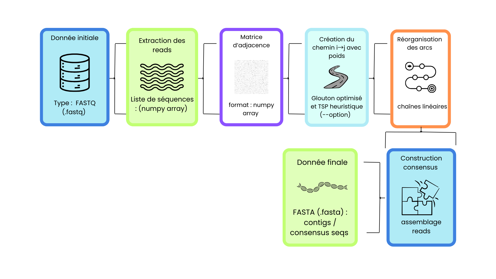
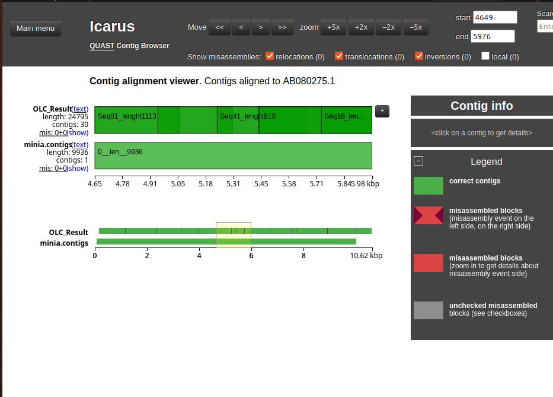
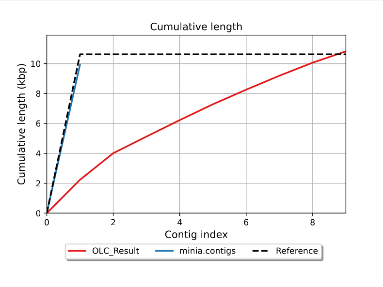

# Cours HAU902I : Bioinformatique avancé  
### Projet : Algorithme d'Assemblage | Fait par : Conceptia Dagba Allade ; Hermine Kiossou ; Homero Sanchez
Github : https://github.com/Hermine-K/Assembleur-

# Algorithme d’Assemblage

L’algorithme d’assemblage repose sur le principe de reconstruire une séquence d’ADN ou d’ARN à partir de fragments courts issus du séquençage. L’objectif est d’exploiter les chevauchements entre ces reads pour retrouver, autant que possible, la séquence originale. Cette étape, réalisée entièrement in silico, suit immédiatement le séquençage d’un organisme, d’une population clonale (comme une culture bactérienne) ou d’un mélange complexe.

Dans ce projet, nous avons réimplémenté un assemblage de type OLC (Overlap–Layout–Consensus). Cette approche nous a permis de suivre en détail chaque phase de l’algorithme (du calcul des chevauchements à la construction du consensus) et d’évaluer son fonctionnement sur des jeux de données réels.

## 1. Overlap-Layout-Consensus

Dans cette méthode, on exploite le calcul des chevauchements pour construire un graphe permettant d’identifier les lectures qui se chevauchent (overlap), de les organiser en une séquence continue (layout) puis de corriger les erreurs afin d’obtenir une séquence consensus.

* La phase **Overlap** consiste à calculer les chevauchements optimaux entre les reads par **alignement semi-global**, à construire progressivement un graphe orienté reliant les reads par des arêtes pondérées selon la qualité du chevauchement, et à exclure les reads entièrement contenus dans d’autres. On peut coder le graph de chevauchement sous la forme de **matrice d’adjacence** où la case **M[i][j]** stocke le poids du chevauchement du read i avec le read j.

* La phase **Layout** vise à trouver un ordre optimal des reads en résolvant un problème de type TSP, que l’on peut aborder soit par des méthodes exactes (comme la programmation dynamique ou le branch and bound), soit par des heuristiques plus rapides (glouton, plus proche voisin, k-opt, Lin Kernighan, etc.), en adaptant le problème asymétrique en un TSP symétrique.

* La phase **consensus** consiste à effectuer un alignement multiple des séquences pour en obtenir une version optimisée en score, mais comme l’alignement exact devient rapidement impraticable au-delà d’une dizaine de séquences, on utilise généralement des méthodes heuristiques.

## 2. Avantages et Inconvénients  

### a. Avantages

* Très adapté aux longues lectures.
  
* Assemblage généralement plus continus : Les longues lectures peuvent traverser des zones répétées du génome sans se casser en morceaux, ce qui permet de reconstruire des séquences plus longues et avec moins de coupures.

* Modèle explicite de l’assemblage : Le graphe OLC offre une vision claire des chevauchements entre les lectures et facilite les étapes de correction ou de vérification.

* Résistant aux erreurs systématiques : Les erreurs aléatoires des lectures longues sont largement corrigées lors de la phase de consensus final.

---

### b. Inconvénients

* Coût computationnel élevé : Comparer toutes les lectures entre elles demande beaucoup de temps et de mémoire, ce qui nécessite des optimisations.

* Peu adapté aux très grands jeux de données à courtes lectures : Avec de très nombreuses lectures courtes, l’OLC devient trop lourd et les graphes de Bruijn sont bien plus efficaces.

* Sensibilité aux régions très répétées : Certaines répétitions complexes peuvent créer des ambiguïtés dans le graphe, même avec des lectures longues.

* Pipeline plus complexe : Le processus OLC comporte plusieurs étapes distinctes qu’il peut être plus difficile de paramétrer et d’optimiser que dans un pipeline de Bruijn.

## 3. Pipeline de l'outil d'assemblage OLC

## 4. Choix du langage de programation 

Pour l’implémentation, nous avons retenu Python comme langage principal. Ce choix s’explique d’abord par sa rapidité de développement. Python permet de prototyper, tester et modifier l’algorithme d’assemblage de manière flexible, ce qui est essentiel dans un projet où plusieurs étapes (overlap, layout, consensus) doivent être ajustées progressivement.

Python bénéficie également d’un écosystème scientifique, particulièrement adapté aux besoins de ce projet. Par exemple :

* NumPy permet de manipuler efficacement des matrices, ce qui est crucial pour la construction et l’exploitation de la matrice d'adjacence. Ses tableaux optimisés en C sont nettement plus performants que les listes natives de Python lorsqu'il s'agit d’opérations répétitives et intensives.

* La bibliothèque python_tsp met à disposition des heuristiques TSP déjà optimisées, ce qui nous a permis d’intégrer une solution de layout alternative sans devoir réimplémenter manuellement un solveur complet.

* Python dispose également de nombreuses autres librairies utiles (gestion de fichiers, analyse de séquences, visualisation), permettant d’envisager facilement des extensions futures.

Enfin, Python offre une lisibilité élevée, ce qui facilite la compréhension et la maintenance du code, notamment dans un contexte collaboratif.

## 5. Algorithmes correspondant à chacune des étapes

### a. Extraction des reads : 

    Algorithme ExtractionReads_FastQ
    Entrée :
       fichier_fastq : chemin vers le fichier FASTQ
    Sortie :
       Reads : liste de séquences

     Début
       Ouvrir fichier_fastq en lecture;
       Reads <- [];
       longueur_ref <- 0;
       compteur <- 0;

       Tant que fichier n’est pas fini faire          // Chaque read = 4 lignes dans FASTQ
          ignorer_ligne();                           // Header 
          sequence <- lire_ligne();
          ignorer_ligne();                           // Ligne "+"
          ignorer_ligne();                           // Qualité

          Si compteur == 0 alors
             longueur_ref <- longueur(sequence);
          Sinon Si longueur(sequence) != longueur_ref alors
             ERREUR : "Read de taille différente détecté";
          Fin Si

          Ajouter sequence à Reads;
          compteur <- compteur + 1;
       Fin Tant Que

      Fermer le fichier;
      Retourner Reads;
    Fin

### b. Matrice d’adjacence

    Algorithme overlap
    Entrée :
       A, B : chaînes de caractères
    Sortie :
       o : Entier, longueur du plus long suffixe de A qui est un préfixe de B

    Début
       o <- 0;
       lenA <- longueur(A);
       lenB <- longueur(B);
       max_possible <- min(lenA, lenB);

        // on compare le suffixe de longueur k de A avec le préfixe de longueur k de B
       Pour k allant de 1 à max_possible faire 
          Si sous_chaine(A, lenA - k, lenA) = sous_chaine(B, 0, k) alors
             o <- k;
         Fin Si
      Fin Pour

      Retourner o;
    Fin

    Algorithme matrice_adjacence
    Entrée: 
       Reads: Liste de chaînes de caractères, de taille n
    Sortie: 
       M: matrice d'adjacence des chevauchements (Matrice d'entiers n×n)

    Début
       Pour i allant de 0 à n - 1 faire
           Pour j allant de 0 à n - 1 faire
               Si i = j alors
                  M[i][j] ← -1;
               Sinon 
                  M[i][j] ← overlap(Reads[i], Reads[j]);
               Fin Si
            Fin Pour
        Fin Pour

       Retourner M
    Fin

    
### c. Recherche du chemin hamiltonien :    

    Algorithme Glouton_Layout_Matrice_Optimisé
    Entrée :
        M : matrice d'adjacence des chevauchements (Matrice d'entiers n×n)
        len_read : longueur des reads (entier)
    Sortie :
        chemin : Liste de triplets [i, j, poids] représentant les arcs du chemin hamiltonien 
    Début
        chemin ← liste vide;

        // Suivi des degrés pour construire un chemin sans cycles
        degre_sortant ← liste de n zéros;
        degre_entrant ← liste de n zéros;

        arcs_rejetes_degre ← 0;
        arcs_rejetes_cycle ← 0;

        max_val ← -1;

        // les chevauchements plus courts (7% de la longueur du read) sont pas consultés
        Tant que len(chemin) < n - 1 ou max_val > len_read * 0.07 faire

           max_val ← -1;
           i_max ← 0;
           j_max ← 0;

           Pour i de 0 à n - 1 faire
               Pour j de 0 à n - 1 faire 
                    Si i ≠ j et M[i, j] > max_val alors 
                      i_max ← i;
                      j_max ← j;
                      max_val ← M_copy[i, j];      // Chevauchement maximal
                    Fin Si
               Fin Pour
           Fin Pour

           // Vérification des conditions d’ajout
           Si max_val > len_read * 0.07 alors :

              // Vérifier les contraintes de degré
              Si degre_sortant[i_max] ≥ 1 ou degre_entrant[j_max] ≥ 1 alors 
                 arcs_rejetes_degre ← arcs_rejetes_degre + 1;
              // Vérifier si on crée un cycle
              Sinon Si CREER_CYCLE(chemin, i_max, j_max) = VRAI alors :
                 arcs_rejetes_cycle ← arcs_rejetes_cycle + 1;
            Sinon
                 // Ajouter l'arc au chemin
                 Ajouter [i_max, j_max, max_val] à chemin;
                 degre_sortant[i_max] ← degre_sortant[i_max] + 1;
                 degre_entrant[j_max] ← degre_entrant[j_max] + 1;
             Fin Si

           Fin Si

           // Supprimer les arcs liés à i_max et j_max
           Pour k de 0 à n - 1 faire
               M[i_max, k] ← -1;
               M[k, j_max] ← -1;
           Fin Pour

      Fin Tant que

       Retourner chemin;
    Fin

    

### d. Consensus :   

    Algorithme reoganiser_chemin
    Entrée
        chemin : liste de triplets [i, j, poids] représentant des arcs
    Sortie 
        chemin_organisé : Liste de chaînes, où chaque chaîne est une liste ordonnée d'arcs

    Début
       Si chemin est vide alors
          Retourner liste vide
       Fin Si
       
       // Construction du graphe
       successeurs ← dictionnaire vide 
       predecesseurs ← ensemble vide 
       tous_reads ← ensemble vide

       Pour chaque arc dans chemin faire
          i ← arc[0] 
          j ← arc[1]
          poids ← arc[2] 

          successeurs[i] ← (j, poids) 
          Ajouter j à predecesseurs 
          Ajouter i à tous_reads 
          Ajouter j à tous_reads
       Fin Pour

       // Identification des points de départ 
       points_depart ← tous_reads - predecesseurs
       # Calculer le seuil minimal (5% du nombre d'arcs)
       seuil_minimal = len(chemin) * 0.05)
  

       Pour chaque depart dans points_depart faire 
          chaine ← liste vide
          courant ← depart
          visite ← ensemble vide

          // Suivre la chaîne tant qu'il y a un successeur
          Tant que courant ∈ successeurs et courant ∉ visite faire
              Ajouter courant à visite 
              suivant, poids ← successeurs[courant]
              Ajouter [courant, suivant, poids] à chaine
              courant ← suivant
              
              Fin Tant que
              Si chaine n'est pas vide alors
	              Si len(chaine)>= seuil_minimal alors
                     Ajouter chaine à chaines //Chaine trouvé
                  Fin Si
             Fin Si

           Fin Tant que

           Si chaine n'est pas vide alors
              Ajouter chaine à chaines // Chaine trouvé
           Fin Si
       Fin Pour

       Si chaines est vide alors
          Retourner liste vide
       Fin Si

       Retourner chaines
    Fin

    Algorithme consensus
    Entrée
       Reads : tableau de séquences (chaînes de caractères)
       chemin_brut : liste de triplets [i, j, poids] représentant des arcs
    Sortie 
       Liste de séquences consensus (chaînes de caractères)

    Début
       Si chemin_brut est vide alors
          Afficher "ERREUR: Chemin vide" 
          Retourner liste vide
       Fin Si

       // Réorganisation du chemin 
       toutes_les_chaines ← reorganiser_chemin(chemin_brut)
       Si toutes_les_chaines est vide alors
          Afficher "ERREUR: Impossible de réorganiser" 
          Retourner liste vide
       Fin Si

       seqs ← liste vide

       // Construction du consensus pour chaque chaîne 
       Pour index de 0 à |toutes_les_chaines| - 1 faire
           chaine_ordonnee ← toutes_les_chaines[index] 
           Premier assemblage i0, j0, p0 ← chaine_ordonnee[0]
           seq ← Reads[i0] + Reads[j0][p0:]

           // Assemblages suivants 
           Pour k de 1 à |chaine_ordonnee| - 1 faire 
              i, j, p ← chaine_ordonnee[k] 
              seq ← seq + Reads[j][p:] 
           Fin Pour 

           Ajouter seq à seqs
       Fin Pour

       Retourner seqs
    Fin

## 6. Évaluation de l’assembleur sur le génome mitochondrial du varan de Komodo

Le programme a été exécuté sur les reads du génome mitochondrial du varan de Komodo. Le temps moyen obtenu est de **4 min 13,55 s**.
Voici les difficultés rencontrées et les filtres mis en place.

### Difficultés rencontrées

* Mise en place et contrôle du chemin hamiltonien

    * Trouver un ordre cohérent des reads n’a pas été direct. Il faut vérifier que chaque read n’apparaît qu’une fois et que le chemin reste valide.

* Plusieurs passages ont été nécessaires pour corriger les incohérences dans l’enchaînement.

    * Construction du consensus

* Le consensus n’était pas faisable tant que le chemin restait sous forme de graphe.

    * Il a fallu réorganiser l’enchaînement des reads en une chaîne linéaire avant de pouvoir fusionner les segments correctement.

### Filtres ajoutés pour stabiliser l’assemblage

* Reads dupliqués ignorés : ils surchargeaient la matrice d’adjacence et créaient des arcs inutiles.

* Chevauchement minimal fixé à 7 % : cela élimine les recouvrements trop courts, souvent non fiables.

* Longueur minimale du chemin consensus à 3 % des arcs : les chemins trop petits n’apportaient rien et brouillaient les résultats.

## 7. Analyse de l'assemblage avec QUAST

### a. Résultats numériques 

| Métrique              | OLC_Result | Minia  | Observations                                   |
|-----------------------|------------|--------|-----------------------------------------------|
| Nombre de contigs      | 9         | 1      | OLC fragmente l'assemblage                   |
| Longueur totale        | 10 822 bp  | 9 936 bp | OLC génère des duplications (ratio 2,374×)  |
| Contig le plus long    |2 233 bp   | 9 936 bp | Minia reconstruit la séquence complète       |
| N50                    | 1101 bp     | 9 936 bp | Contiguïté excellente pour Minia             |
| Couverture du génome   | 80.055%      | 93,5%  | OLC couvre moin bien et avec des redondances      |

---

### b. Lecture des visualisations QUAST

#### b-1. Icarus : Alignement des contigs

##### Référence (Minia)

* La référence apparaît sous la forme d’un bloc continu, sans rupture.

* Représente la structure attendue du génome mitochondrial.

* Sert de base pour vérifier l’alignement des séquences produites par notre assembleur.

##### Notre assembleur OLC

* Aucun misassemblage détecté : les segments produits ne se placent jamais dans une mauvaise région.

* L’alignement montre seulement quelques consensus qui s’ancrent correctement sur la référence.

* L’assembleur n’a pas pu produire une séquence complète :

     * les contigs générés restent isolés,

     * ils couvrent uniquement certaines portions du génome.

* Le résultat apparaît donc sous forme de petits blocs dispersés alignés sur le bloc continu de la référence.

L’OLC produit des fragments justes mais incapables d’être fusionnés en une séquence complète.

---

#### b-2. Courbe de longueur cumulée

##### Minia (Bleu) : Assemblage Réussi 

* Atteint la longueur de référence (~10.4 kbp) dès le 1er contig (indice 1).

* Il y a eu de faible fragmentation et une grande fidélité à la longueur du génome. L'algorithme a efficacement résolu les répétitions.

##### OLC (Rouge) : Assemblage Fragmenté et Redondant

* Nécessite 9 contigs pour atteindre la longueur totale (biaser par les chevauchements des contigs).

* Le graphe OLC identifie correctement les chevauchements mais ne parvient pas à produire une chaîne unique.

---

#### b-3. Profil de GC (%)

Le graphique compare le contenu en GC des contigs à la référence.

* Les courbes se recouvrent globalement, ce qui indique que :

   * les contigs OLC ne contiennent pas d’anomalies majeures,

   * pas de contamination évidente,

   * pas d’erreur systématique dans les bases.

* Les variations visibles côté OLC viennent du fait que les contigs sont courts. Le GC (%) fluctue davantage.

Même si l’assemblage est fragmenté, le contenu des contigs reste biologiquement cohérent.

---

### c. Forces et limites de notre OLC

#### Points positifs

* Aucun misassemblage structurel.

* Alignements corrects (blocs verts dans Icarus).

* Couverture correcte malgré les filtres appliqués.

* Les chevauchements et l’ordre local des reads sont bien identifiés.

#### Points faibles

* Fragmentation importante. Il est impossible de fusionner les chemins en un seul contig.

* La duplication des régions fait que la longueur totale est artificiellement augmentée.

* N50 faible.

* Plusieurs mismatchs.

* Résultat final difficilement exploitable biologiquement.

## 8. Option heuristique TSP
Nous avons utilisé une librairie Python TSP pour construire le chemin consensuel via un algorithme 2-OPT. Cependant, cette approche reste longue (environ 10 minutes d’exécution) et n’améliore pas les résultats par rapport à notre outil. Elle génère plusieurs consensus d’environ 30 000 pb fait de 139 petites séquences.

## Conclusion

Notre approche OLC fonctionne pour détecter les chevauchements et produire des fragments fiables, mais l’algorithme glouton utilisé pour le layout ne permet pas de réunir les contigs en une séquence complète.
Minia, basé sur un graphe de De Bruijn, produit un résultat plus contigu, sans duplication, et plus proche du génome réel.
